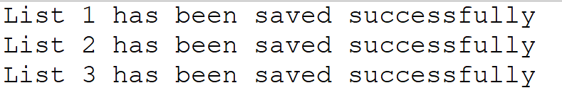
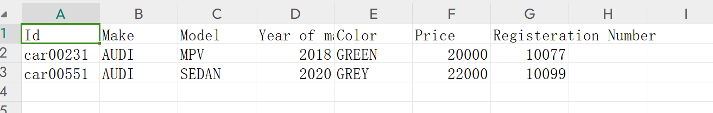
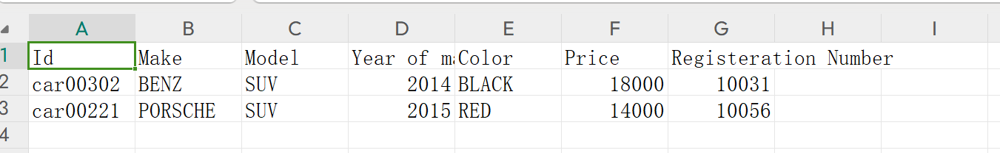
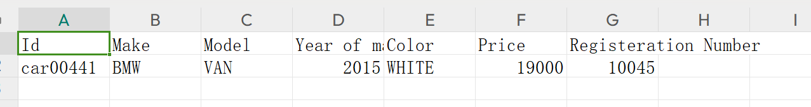

# Java Homework Assignment 2 Description
**Matriculation Number: 7221539**

**Development Environment: Windows 11 x64, Eclipse 2023-06, Java 17**

The program define a Car class and uses enum to define parts of the properties, it also defines setter and getter. Finally, in the main function, it creates a list of cars and saves the specified ones to different csv files.

